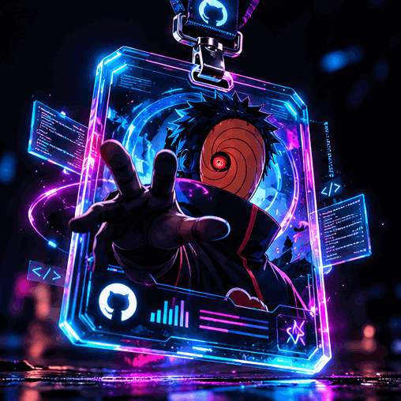

<table width="100%" border="0">
<tr>
<td width="58%" align="center" valign="middle">

  

</td>

<td width="42%" align="center" valign="middle">

</td>
</tr>
</table>

 

 About Me

<table>
<tr>
<td width="65%" valign="top">

🎓 B.Tech CSE — AI Engineering

💻 Full Stack Developer

⚛️ Building modern web applications with React

🖥️ Backend development with Node.js, Express.js & MongoDB

🔐 Interested in authentication, APIs and scalable application architecture

🔄 Exploring real-time systems

🧠 Currently moving deeper into Data Science & AI/ML

🚀 Love building practical projects instead of only learning theory

🇮🇳 Based in India

🎯 Goal: Build production-ready products and grow into an AI/ML Engineer

</td>

<td width="35%" align="center">

</td>
</tr>
</table>

 Tech Stack

Frontend

Backend & Database

Languages & Tools

 

 GitHub Analytics

  

&nbsp;

 

 Contribution Streak

 GitHub Trophies

 

 Currently Learning

 Roadmap

Frontend
   ↓
Backend
   ↓
Full Stack Projects
   ↓
Data Science
   ↓
AI / ML
   ↓
AI Engineer

 Let's Connect

&nbsp;

&nbsp;

&nbsp;

 

<h2 align="center">

Quote
</h2>

<i>"Code. Create. Innovate. Repeat."</i>

